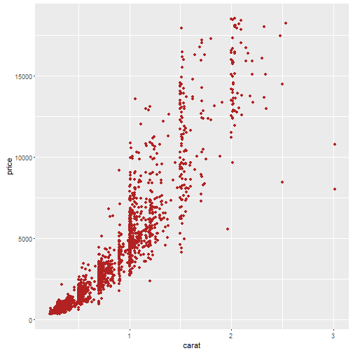

## Coursera Task

Feb 10, 2016
E.Cambui Junior

---

## Exploring the Diamonds

What drives the **diamond's** prices?

---

## Exploring the Diamonds

Explore the connection between several features of diamonds, like carat, cut, clarity, color and price

---

## Diamonds with ggplot2

---

Example Calculation

library(ggplot2); data(diamonds)
subset = diamonds$carat < 1.5 & diamonds$cut == "Ideal" & diamonds$clarity == "VS1"
qplot(carat, price, data = diamonds[subset,], colour = color, geom = c("point", "smooth"),method = "lm")

---
